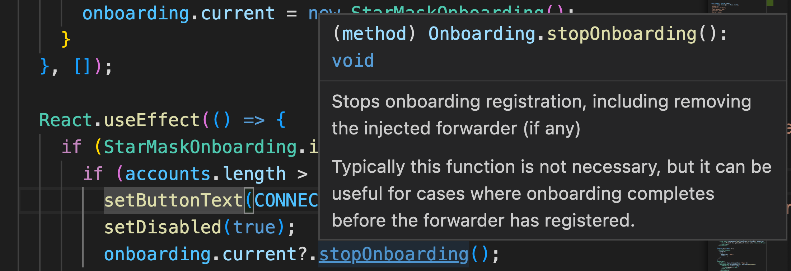
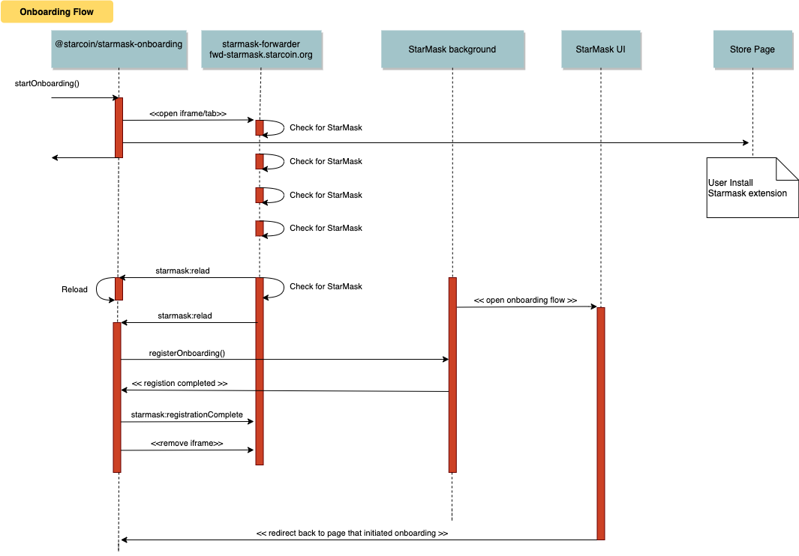

# Onboarding Library

As an Starcoin enabled site developer, sending users offsite to install StarMask presents challenges. Most notably, you must inform the user to return to your site and refresh their browser after the installation. Your site will detect the user's newly installed StarMask extension only after that refresh. We at StarMask care deeply about user experience, and we knew that this workflow needed to be improved.

StarMask now provides a [starmask-onboarding library](https://github.com/starcoinorg/starmask-onboarding) designed to improve and simplify the onboarding experience. The new library exposes an API to initiate the onboarding process. In the process, it registers your site as the origin of the onboarding request. StarMask will check for this origin after the user completes the onboarding flow. If it finds an origin, the final confirmation button of the StarMask onboarding flow will indicate that the user will be redirected back to your site.

## Getting Started

1. Install @starcoin/starmask-onboarding using npm or yarn.
2. Import the Onboarding Library or include it in your page.

```javascript
// As an ES6 module
import StarMaskOnboarding from "@starcoin/starmask-onboarding";
// Or as an ES5 module
const StarMaskOnboarding = require("@starcoin/starmask-onboarding");
```

If you'd prefer you can instead include the prebuilt ES5 bundle that ships with the library:

```html
<script src="./starmask-onboarding.bundle.js"></script>
```

3. Create a new instance of the Onboarding library

```javascript
const onboarding = new StarMaskOnboarding();
```

4. Start the onboarding process in response to a user event (e.g. a button click).

```javascript
onboarding.startOnboarding();
```

## Examples

### Basic Usage

```javascript
const onboarding = new StarMaskOnboarding();
onboarding.startOnboarding();
```

### Using React

```jsx
import StarMaskOnboarding from "@starcoin/starmask-onboarding";
import React from "react";

const ONBOARD_TEXT = "Click here to install StarMask!";
const CONNECT_TEXT = "Connect";
const CONNECTED_TEXT = "Connected";

export function OnboardingButton() {
  const [buttonText, setButtonText] = React.useState(ONBOARD_TEXT);
  const [isDisabled, setDisabled] = React.useState(false);
  const [accounts, setAccounts] = React.useState([]);
  const onboarding = React.useRef();

  React.useEffect(() => {
    if (!onboarding.current) {
      onboarding.current = new StarMaskOnboarding();
    }
  }, []);

  React.useEffect(() => {
    if (StarMaskOnboarding.isStarMaskInstalled()) {
      if (accounts.length > 0) {
        setButtonText(CONNECTED_TEXT);
        setDisabled(true);
        onboarding.current?.stopOnboarding();
      } else {
        setButtonText(CONNECT_TEXT);
        setDisabled(false);
      }
    }
  }, [accounts]);

  React.useEffect(() => {
    function handleNewAccounts(newAccounts) {
      setAccounts(newAccounts);
    }
    if (StarMaskOnboarding.isStarMaskInstalled()) {
      window.starcoin
        .request({ method: "stc_requestAccounts" })
        .then(handleNewAccounts);
      window.starcoin.on("accountsChanged", handleNewAccounts);
      return () => {
        window.starcoin.off("accountsChanged", handleNewAccounts);
      };
    }
  }, []);

  const onClick = () => {
    if (StarMaskOnboarding.isStarMaskInstalled()) {
      window.starcoin
        .request({ method: "stc_requestAccounts" })
        .then((newAccounts) => setAccounts(newAccounts));
    } else {
      onboarding.current?.startOnboarding();
    }
  };
  return (
    <button disabled={isDisabled} onClick={onClick}>
      {buttonText}
    </button>
  );
}
```

### Using TypeScript

We ship our TypeScript types with `@starcoin/starmask-onboarding`. Modifying the above example to get type safety when using the onboarding library is simple:

```jsx
  -const onboarding = React.useRef();
  +const onboarding = React.useRef<StarMaskOnboarding>();
```

Doing this step will give you editor auto-completion for the methods exposed by the library, and helpful documentation.



### Using Vanilla Javascript + HTML

```html
<!DOCTYPE html>
<html lang="en-CA">
  <head>
    <title>StarMask Onboarding Example</title>
    <meta charset="UTF-8" />
  </head>
  <body>
    <h1>Sample Dapp</h1>
    <button id="onboard">Loading...</button>
    <script src="./starmask-onboarding.bundle.js"></script>
    <script>
      window.addEventListener("DOMContentLoaded", () => {
        const onboarding = new StarMaskOnboarding();
        const onboardButton = document.getElementById("onboard");
        let accounts;

        const updateButton = () => {
          if (!StarMaskOnboarding.isStarMaskInstalled()) {
            onboardButton.innerText = "Click here to install StarMask!";
            onboardButton.onclick = () => {
              onboardButton.innerText = "Onboarding in progress";
              onboardButton.disabled = true;
              onboarding.startOnboarding();
            };
          } else if (accounts && accounts.length > 0) {
            onboardButton.innerText = "Connected";
            onboardButton.disabled = true;
            onboarding.stopOnboarding();
          } else {
            onboardButton.innerText = "Connect";
            onboardButton.onclick = async () => {
              await window.starcoin.request({
                method: "stc_requestAccounts",
              });
            };
          }
        };

        updateButton();
        if (StarMaskOnboarding.isStarMaskInstalled()) {
          window.starcoin.on("accountsChanged", (newAccounts) => {
            accounts = newAccounts;
            updateButton();
          });
        }
      });
    </script>
  </body>
</html>
```

## Onboarding Diagram

Here is a diagram of the interactions between the onboarding library, the forwarder, and the extension:


